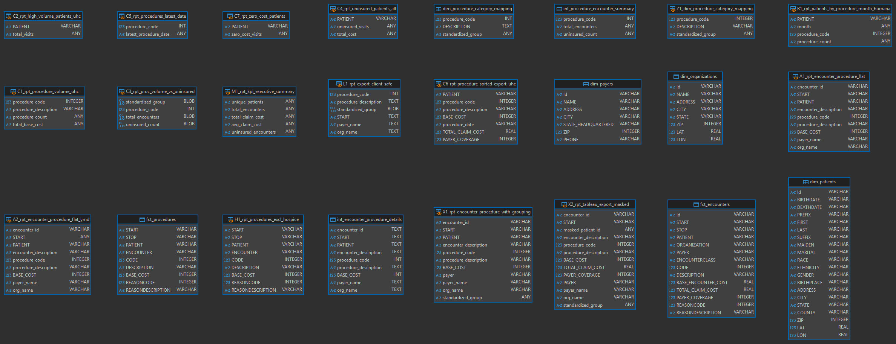

# 💊 MyTomorrows – Scalable & Secure Client Reporting  
_A case study for a growing Patient Advocacy Group_

---

## 🎯 Objective  
Design a scalable, secure, and privacy-compliant reporting workflow to support both internal and client-facing analytics in a healthcare setting.

---

## 📌 Deliverables Naming Convention  

Each deliverable is named as required:  
- Task 1 → `D1.A`, `D1.B`, etc.  
- Task 2 → `D2.A`, `D2.B`, etc.

---

## 🧰 Tooling Overview

| Layer         | Tools Used                               |
|---------------|-------------------------------------------|
| Data Storage  | SQLite (sandbox), PostgreSQL (planned)   |
| Transformation| Manual SQL Views, DBT (proposed)         |
| Orchestration | Airflow (planned)                        |
| Visualization | Tableau (Excel workaround for local dev) |

---
## 🗺️ Entity Relationship Diagram

The diagram below illustrates the structure used in the data model:




---

## 🧠 Task 1: Build a Client-Facing Report (United Healthcare)

UnitedHealthcare requested a secure, standardized view of their patient data. The objectives were:

- Standardize insurance coverage for treatments (group similar procedures)  
- Identify high-volume procedures and patients missed (especially uninsured)  
- Export the data sorted by procedure and latest procedure date  
- Receive data visualizations via Tableau, without exposing patient PII  

---

# 🧩 D1.A – How I Would Model and Transform the Data

<details>
<summary><strong>1️⃣ Source Layer – Staging Models</strong></summary>

```sql
CREATE VIEW A2_rpt_encounter_procedure_flat_ymd AS
SELECT 
  e.Id AS encounter_id,
  STRFTIME('%Y-%m-%d', e.START) AS START,
  e.PATIENT,
  e.DESCRIPTION AS encounter_description,
  p.CODE AS procedure_code,
  p.DESCRIPTION AS procedure_description,
  p.BASE_COST,
  pa.NAME AS payer_name,
  o.NAME AS org_name
FROM fct_procedures p
JOIN fct_encounters e ON p.ENCOUNTER = e.Id
JOIN dim_payers pa ON e.PAYER = pa.Id
JOIN dim_organizations o ON e.ORGANIZATION = o.Id;
```

</details>

<details>
<summary><strong>2️⃣ Intermediate Layer – Grouping Logic</strong></summary>

```sql
CREATE VIEW X1_rpt_encounter_procedure_with_grouping AS
SELECT 
  e.Id AS encounter_id,
  e.START,
  e.PATIENT,
  p.CODE AS procedure_code,
  p.DESCRIPTION AS procedure_description,
  p.BASE_COST,
  e.PAYER,
  pa.NAME AS payer_name,
  o.NAME AS org_name,
  CASE
    WHEN LOWER(p.DESCRIPTION) LIKE '%assessment%' THEN 'Assessment'
    WHEN LOWER(p.DESCRIPTION) LIKE '%screening%' THEN 'Screening'
    -- (remaining cases shortened for brevity)
    ELSE 'Other'
  END AS standardized_group
FROM fct_procedures p
JOIN fct_encounters e ON p.ENCOUNTER = e.Id
JOIN dim_payers pa ON e.PAYER = pa.Id
JOIN dim_organizations o ON e.ORGANIZATION = o.Id;
```

</details>

<details>
<summary><strong>3️⃣ Reporting Layer – Final Views</strong></summary>

```sql
CREATE VIEW C1_rpt_procedure_volume_uhc AS
SELECT
  p.CODE AS procedure_code,
  p.DESCRIPTION AS procedure_description,
  COUNT(*) AS procedure_count,
  SUM(p.BASE_COST) AS total_base_cost
FROM fct_procedures p
JOIN fct_encounters e ON p.ENCOUNTER = e.Id
JOIN dim_payers py ON e.PAYER = py.Id
WHERE py.NAME = 'UnitedHealthcare'
GROUP BY p.CODE, p.DESCRIPTION;
```

</details>

<details>
<summary><strong>4️⃣ Privacy & Masking Logic</strong></summary>

```sql
substr(HEX(abs(e.PATIENT * 100000007 % 1000000007)), 1, 12) AS masked_patient_id
```

</details>

---


---

## ✅ Why This Structure?

- Each layer is clean, logical, and reusable  
- Modular views make debugging and future development easier  
- Mimics DBT-style transformations, enabling lineage tracking  
- Designed with privacy and export-readiness in mind  
- Ideal for use in Tableau or other BI tools  

---

# 📊 D1.B – Tableau Dashboard Mockup Plan

<details>
<summary><strong>📋 Filters</strong></summary>

- Procedure Group  
- Date Range  
- Insurance Coverage  

</details>

<details>
<summary><strong>📌 KPI Tiles</strong></summary>

- Total Encounters  
- High-Volume Patients  
- Uninsured Patients  

</details>

<details>
<summary><strong>📊 Bar Chart</strong></summary>

- X-axis: Procedure Group  
- Y-axis: Encounter Count  

</details>

<details>
<summary><strong>📈 Line Chart</strong></summary>

- X-axis: Procedure Date  
- Y-axis: Monthly Encounter Volume  

</details>

<details>
<summary><strong>📄 Table Export</strong></summary>

- Procedure Group  
- Cost  
- Procedure Date  
- Organization Name  
- Payer Name  

</details>

---

# 🔐 D1.C – Filters and Permissions for Secure Client Access

<details>
<summary><strong>🧮 SQL-Level Row-Level Security</strong></summary>

```sql
WHERE client = 'United Healthcare'
```

Apply via:
- Secure View in PostgreSQL  
- DBT Model logic  

</details>

<details>
<summary><strong>📊 Tableau-Level Permissions</strong></summary>

- Assign users to group: `Client_UHC`  
- Filter using:  
```tableau
ISMEMBEROF('Client_UHC')
```
- Drop or mask PII fields before Tableau ingestion  

</details>

<details>
<summary><strong>📤 Export Limitations</strong></summary>

- CSV export from sanitized datasets only  
- Restrict access via Tableau Server permissions  

</details>

<details>
<summary><strong>🧾 Access Control Summary</strong></summary>

| Layer   | Technique                         | Purpose                            |
|---------|-----------------------------------|------------------------------------|
| SQL     | RLS via View/DBT                  | Client-level filtering             |
| Tableau | Groups + Filters                  | Secure data delivery               |
| Export  | Server controls                   | Prevent PII exposure               |

</details>
