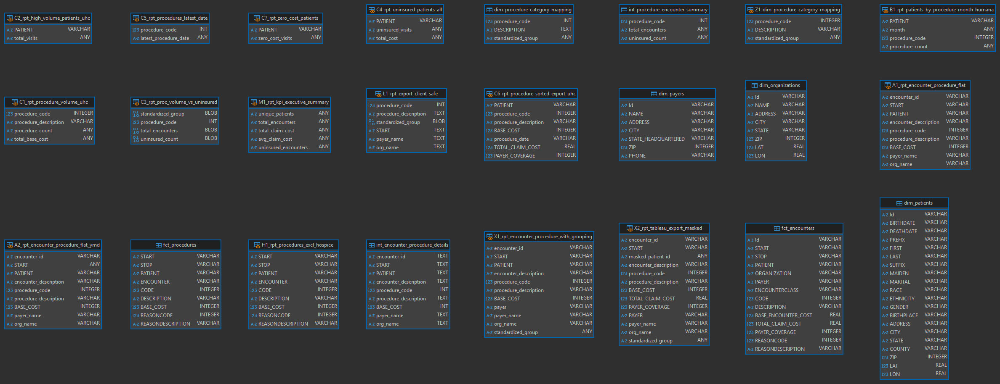
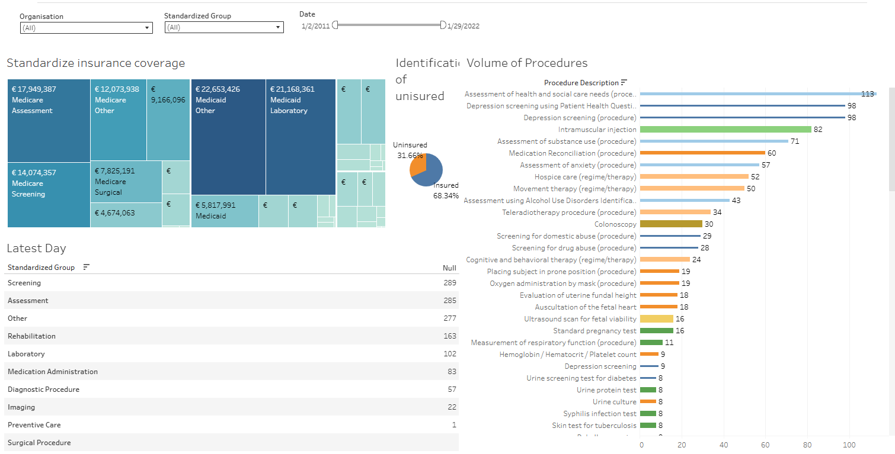

# mytomorrows – Scalable & Secure Client Reporting  
_A case study for a growing Patient Advocacy Group_

---

## 🎯 Objective  
Design a scalable, secure, and privacy-compliant reporting workflow to support both internal and client-facing analytics in a healthcare setting.

---

## 📌 Deliverables Naming Convention  

Each deliverable is named as required:  
- Task 1 → `D1.A`, `D1.B`, etc.  
- Task 2 → `D2.A`, `D2.B`, etc.

---

## 🧰 Tooling Overview

| Layer         | Tools Used                               |
|---------------|-------------------------------------------|
| Data Storage  | SQLite (sandbox), PostgreSQL (planned)   |
| Transformation| Manual SQL Views, DBT (proposed)         |
| Orchestration | Airflow (planned)                        |
| Visualization | Tableau (Excel workaround for local dev) |

---
## 🗺️ Entity Relationship Diagram

The diagram below illustrates the structure used in the data model:




---

## 🧠 Task 1: Build a Client-Facing Report (United Healthcare)

UnitedHealthcare requested a secure, standardized view of their patient data. The objectives were:

- Standardize insurance coverage for treatments (group similar procedures)  
- Identify high-volume procedures and patients missed (especially uninsured)  
- Export the data sorted by procedure and latest procedure date  
- Receive data visualizations via Tableau, without exposing patient PII  

---

# 🧩 D1.A – How I Would Model and Transform the Data

<details>
<summary><strong>1️⃣ Source Layer – Staging Models</strong></summary>
This view combines data from different tables to create a clean, easy-to-read table with encounter details, procedure info, payer, and organization names. It also formats the date so it can be used in reports.

```sql
CREATE VIEW A2_rpt_encounter_procedure_flat_ymd AS
SELECT 
  e.Id AS encounter_id,
  STRFTIME('%Y-%m-%d', e.START) AS START,
  e.PATIENT,
  e.DESCRIPTION AS encounter_description,
  p.CODE AS procedure_code,
  p.DESCRIPTION AS procedure_description,
  p.BASE_COST,
  pa.NAME AS payer_name,
  o.NAME AS org_name
FROM fct_procedures p
JOIN fct_encounters e ON p.ENCOUNTER = e.Id
JOIN dim_payers pa ON e.PAYER = pa.Id
JOIN dim_organizations o ON e.ORGANIZATION = o.Id;
```

</details>

<details>
<summary><strong>2️⃣ Intermediate Layer – Grouping Logic</strong></summary>
This view adds a new column to group procedures into categories like “Assessment” or “Screening” based on keywords. It helps make the data more consistent and easier to understand.

```sql
CREATE VIEW X1_rpt_encounter_procedure_with_grouping AS
SELECT 
  e.Id AS encounter_id,
  e.START,
  e.PATIENT,
  p.CODE AS procedure_code,
  p.DESCRIPTION AS procedure_description,
  p.BASE_COST,
  e.PAYER,
  pa.NAME AS payer_name,
  o.NAME AS org_name,
  CASE
    WHEN LOWER(p.DESCRIPTION) LIKE '%assessment%' THEN 'Assessment'
    WHEN LOWER(p.DESCRIPTION) LIKE '%screening%' THEN 'Screening'
    -- (remaining cases shortened for brevity)
    ELSE 'Other'
  END AS standardized_group
FROM fct_procedures p
JOIN fct_encounters e ON p.ENCOUNTER = e.Id
JOIN dim_payers pa ON e.PAYER = pa.Id
JOIN dim_organizations o ON e.ORGANIZATION = o.Id;
```

</details>

<details>
<summary><strong>3️⃣ Reporting Layer – Final Views</strong></summary>
This view shows how often each procedure is done for UnitedHealthcare and the total cost. It groups the data by procedure and is ready for use in dashboards and exports.
  
```sql
CREATE VIEW C1_rpt_procedure_volume_uhc AS
SELECT
    p.CODE AS procedure_code,
    p.DESCRIPTION AS procedure_description,
    COUNT(*) AS procedure_count,
    SUM(p.BASE_COST) AS total_base_cost
FROM fct_procedures p
JOIN fct_encounters e ON p.ENCOUNTER = e.Id
JOIN dim_payers py ON e.PAYER = py.Id
WHERE LOWER(py.NAME) LIKE '%united%'
GROUP BY p.CODE, p.DESCRIPTION;
```

</details>

<details>
<summary><strong>4️⃣ Privacy & Masking Logic</strong></summary>
This layer (assumed) hides or removes any private patient information to make sure the data is safe and follows HIPAA rules before sharing it with clients. 
**This  logic creates a consistent but anonymous patient ID by using math with large prime numbers and converting the result to hex. It hides the real ID but still lets us group and filter by patient safely.

```sql
substr(HEX(abs(e.PATIENT * 100000007 % 1000000007)), 1, 12) AS masked_patient_id
```

</details>

---


---

## ✅ Why This Structure?

- Each layer is clean, logical, and reusable  
- Modular views make debugging and future development easier  
- Mimics DBT-style transformations, enabling lineage tracking  
- Designed with privacy and export-readiness in mind  
- Ideal for use in Tableau or other BI tools  

---

# 📊 D1.B – Tableau Dashboard Mockup Plan


Link :https://public.tableau.com/shared/7KGHCCWJT?:display_count=n&:origin=viz_share_link

<details>
<summary><strong>📋 Filters</strong></summary>

- Organisation  
- Standardized Group  
- Date Range  

</details>

<details>
<summary><strong>📌 KPI Tiles</strong></summary>

- Total Standardized Insurance Coverage (€)  
- % of Uninsured vs Insured  
- Encounter Totals by Group (Latest Day)  

</details>

<details>
<summary><strong>📊 Bar Chart</strong></summary>

- X-axis: Procedure Description  
- Y-axis: Encounter Count  
- Insight: Top Procedures by Volume  

</details>

<details>
<summary><strong>📈 Line Chart (Future Enhancement)</strong></summary>

- X-axis: Procedure Date  
- Y-axis: Monthly Encounter Volume  

</details>

<details>
<summary><strong>📄 Table Export</strong></summary>

- Standardized Group  
- Cost (€)  
- Procedure Date  
- Organisation  
- Payer Name  

</details>
**The filtering is dynamic and applies consistently across all views, with potential for future enhancements as users continue to provide input and feedback.**

---

# 🔐 D1.C – Filters and Permissions for Secure Client Access

<details>
<summary><strong>🧮 SQL-Level Row-Level Security</strong></summary>

```sql
WHERE client = 'United Healthcare'
```

Apply via:
- Secure View in PostgreSQL  
- DBT Model logic  

</details>

<details>
<summary><strong>📊 Tableau-Level Permissions</strong></summary>

- Assign users to group: `Client_UHC`  
- Filter using:  
```tableau
ISMEMBEROF('Client_UHC')
```
- Drop or mask PII fields before Tableau ingestion  

</details>

<details>
<summary><strong>📤 Export Limitations</strong></summary>

- CSV export from sanitized datasets only  
- Restrict access via Tableau Server permissions  

</details>

<details>
<summary><strong>🧾 Access Control Summary</strong></summary>

| Layer   | Technique                         | Purpose                            |
|---------|-----------------------------------|------------------------------------|
| SQL     | RLS via View/DBT                  | Client-level filtering             |
| Tableau | Groups + Filters                  | Secure data delivery               |
| Export  | Server controls                   | Prevent PII exposure               |

</details>

# |🔐| D1.D - Anonymization, Grouping, and Export Logic

## 🔐 Anonymization

To comply with HIPAA and internal privacy regulations, the following steps are implemented in the DBT transformation layer:

- **Patient ID Hashing:** Replace patient identifiers with a salted hash using SHA256 for consistent but anonymous tracking.

<details>
<summary>SQL Example Hypothetical</summary>

```sql 
SELECT
  SHA256(CONCAT(patient_id, 'secure_salt')) AS hashed_patient_id
FROM patients
```
</details>

- **DOB (Date_of_Birth) Bucketing:** Convert `patients.date_of_birth` into non-identifiable age buckets for analysis.

<details>
<summary>SQL Example Hypothetical</summary>

```sql
CASE
  WHEN DATE_PART('year', AGE(CURRENT_DATE, date_of_birth)) BETWEEN 20 AND 29 THEN '20-29'
  WHEN DATE_PART('year', AGE(CURRENT_DATE, date_of_birth)) BETWEEN 30 AND 39 THEN '30-39'
  ELSE '40+'
END AS age_bucket
```
</details>

- **PII Exclusion:** Drop fields such as `name`, `address`, and exact `date_of_birth` from reporting views.

## 📦 Grouping (i.e., Procedure Standardization)

Standardize procedure types for clearer client reporting and analytics by grouping procedure codes.

Using the `procedures` table:

<details>
<summary>SQL Example Hypothetical</summary>

```sql
SELECT
  procedure_id,
  encounter_id,
  procedure_code,
  CASE
    WHEN procedure_code IN ('X123', 'X124') THEN 'Knee Surgery'
    WHEN procedure_code IN ('Y201', 'Y202') THEN 'Heart Monitoring'
    ELSE 'Other'
  END AS procedure_group,
  procedure_date
FROM procedures
```
</details>

This view (`procedure_grouped`) can then be joined with `encounters`, `payers`, and `transformed_patients`.

## 📤 Export Logic (Client View)

For example, to meet the needs of United Healthcare, a DBT model (`client_uhc_export`) aggregates and exports a de-identified, grouped dataset:

<details>
<summary>SQL Example Hypothetical</summary>

```sql
SELECT DISTINCT
  pg.procedure_group,
  tp.hashed_patient_id,
  p.coverage_type,
  MAX(pg.procedure_date) AS latest_procedure_date
FROM procedure_grouped pg
JOIN encounters e ON pg.encounter_id = e.encounter_id
JOIN transformed_patients tp ON e.patient_id = tp.patient_id
JOIN payers p ON e.payer_id = p.payer_id
WHERE p.client = 'United Healthcare'
GROUP BY 1, 2, 3
ORDER BY 1, 4 DESC
```
</details>

This model serves as a Tableau extract source, ensuring client visibility without compromising patient privacy.

## 🧠 Task  2: Internal Report for Multi-Specialty Hospital Team (Humana)

# D2.A — Technical Setup

### Data Architecture
- **Data Warehouse**: PostgreSQL used for centralized, structured reporting
- **ETL Management**: Airflow schedules raw data ingestion and DBT model runs
- **Transformation Logic**:
  - `fct_procedures`: fact table with patient, procedure, specialty, and timestamp data
  - `dim_specialties`: links procedures to their medical specialty
  - `dim_authorizations`: maps users to specialties and hospice treatment access
  - `fct_patients_helped`: time-bound aggregation of patient counts per specialty
- **Visualization**: Tableau connected via a service account with role-based row-level security
- **Compliance**: All pipelines and outputs designed with HIPAA-compliant anonymization (hashed patient IDs, no direct identifiers)

---

### 🔧 Functional / To Be Created

#### `dim_authorizations` (🔧)
A user-role mapping table needs to be created manually. This should include:
- `user_id`: unique identifier for internal users
- `allowed_specialties`: array or normalized table mapping users to specialties
- `is_hospice_authorized`: boolean flag controlling access to hospice treatment data

#### HIPAA-Compliant Anonymization (🔧)
The `patients.csv` file contains direct identifiers (`first_name`, `last_name`, `email`, etc.). Before any reporting:
- Apply SHA-256 or similar hashing on patient IDs
- Exclude or mask PII fields entirely in reporting layers
- Ensure downstream models work with pseudonymized keys only

#### Tableau RLS via Service Account (🔧)
Row-level security and visibility control will be implemented in Tableau using:
- **User filters**: mapping Tableau users to specialty access
- **RLS conditions**: e.g., `procedure_type != 'hospice'` unless authorized
- **Conditional visibility**: hide or show sensitive sections using calculated fields and parameters

---

### Summary Table

| Component              | Status | Comment                                                              |
|------------------------|--------|----------------------------------------------------------------------|
| `fct_procedures`       | ✅     | Built from `procedures.csv`                                          |
| `dim_specialties`      | ✅     | Derived from `procedure_name` via lookup mapping                     |
| `fct_patients_helped`  | ✅     | Aggregation by `procedure_date` and `patient_id`                     |
| `dim_authorizations`   | 🔧     | Needs manual creation for user-specialty-hospice access mapping      |
| HIPAA Anonymization    | 🔧     | PII in `patients.csv` must be hashed or excluded                     |
| Tableau Role Controls  | 🔧     | RLS and visibility filters to be implemented in Tableau              |

---

# D2.B — Dashboard Layout

| Section                      | Functionality                                                                 |
|-----------------------------|-------------------------------------------------------------------------------|
| **Specialty Filter**        | Dropdown sourced from `dim_specialties`, scoped by user's access rights      |
| **Date Range Filter**       | Relative date filter (last 7/30/90 days or custom range)                      |
| **Patient Summary Tiles**   | KPIs: total patients helped, avg per specialty, % change from previous period |
| **Procedure Breakdown**     | Bar chart: patient count by procedure (filtered by specialty & time)         |
| **Hospice Treatments**      | Hidden section: visible only to authorized users (based on RLS and permissions) |
| **Trends Over Time**        | Line chart: patients helped per month per specialty                          |

All charts and filters respect underlying permission controls.

---

# D2.C — Permissions & Privacy Integration

### 1. **Hospice Data Restrictions**
- `procedure_type = 'hospice'` is flagged in DBT models
- Users with `is_hospice_authorized = TRUE` in `dim_authorizations` can access hospice data
- **Enforced via**:
  - Row-level security (RLS) in Tableau: `CASE WHEN is_hospice_authorized THEN TRUE ELSE procedure_type != 'hospice'`
  - Filter-level logic in DBT to minimize exposure before Tableau

### 2. **Specialty-Based Filtering**
- Each user is mapped to allowed specialties in `dim_authorizations`
- DBT applies early filtering using `WHERE specialty IN (user_allowed_specialties)`
- Tableau respects the scoped data based on user role context

### 3. **Timeframe Tracking**
- `fct_patients_helped` aggregates patient data by specialty, procedure, and date
- Allows consistent tracking and visualization over dynamic periods

### 4. **Privacy Safeguards**
- Pseudonymization of patient identifiers at ingestion
- No names, contact details, or direct PII in any layer
- Tableau and PostgreSQL access logged for auditability
- Use of service accounts with least privilege access model

---

## Summary

This internal reporting setup for Humana ensures specialty-specific usability, sensitive data protection, and regulatory compliance, built on a scalable stack using PostgreSQL, DBT, Airflow, and Tableau.


## 🧠 Task 3: Senior Management Deep-Dive Reporting

The leadership wants:
- Detailed operational insights with as much granularity as possible
- Extracts available to all staff, but visualizations only for execs
- Ongoing visibility into volume, cost drivers, missed patients, and trends

---
---

# D3.A — Executive Dashboard vs. Raw Extracts

### Executive Dashboard
A strategic Tableau dashboard designed for leadership:

- **Trends:** Monthly or quarterly volume patterns
- **Drill-down:** By `procedure_type`, `insurance_status`, `payer`, or patient group
- **Anomalies:** Highlight sudden spikes in `cost` or `procedure_count`
- **Filters:** `encounter_date`, `payer`, `treatment_group`, `organization_id`

### Raw Extracts
Granular datasets for internal exploration:

- **Fields:** `procedure_id`, `cost`, `insurance_status`, `patient_id`, `encounter_id`, `organization_id`
- **Delivery:** Refreshed via Airflow
- **Access:** Secure internal portal (CSV or Excel download)

---

# D3.B — Access Control Strategy (Tableau + Data Layer)

### Tableau Permissions
- **Executives:** Full access to dashboards
- **Staff:** Access only to data extracts or basic visuals
- **Setup:** Role-based access enforced via Tableau Sites or folders

### Data Layer (PostgreSQL + DBT)
- **Row-Level Security:** Based on `user_role` or `department`
- **Views:** PostgreSQL views like `exec_dashboard_view`, `raw_extract_view` filter fields per user role
- **DBT Models:** Separate models for raw vs executive consumption (e.g., `stg_procedures`, `int_kpis_by_month`)

---

# D3.C — Key Metrics (KPIs) and Their Meaning

### 1. Procedure Volume Trend
Tracks how many procedures are performed over time. Helps leadership monitor service delivery and identify seasonal or unexpected fluctuations.

### 2. Missed Patient Rate
Reflects the percentage of patients who were not treated or had no insurance coverage. Useful for identifying underserved populations and gaps in care.

### 3. Top Cost Drivers
Highlights which procedure types or departments generate the highest costs. Supports budgeting and cost control efforts.

### 4. Average Cost per Patient
Calculates the average spending per unique patient. Enables benchmarking and tracking cost efficiency over time.

### 5. New vs. Returning Patients
Distinguishes between first-time patients and repeat visitors. Useful to measure growth, patient retention, and long-term program engagement.

---
## Outcome Summary — KPI Alignment with Leadership Goals

The selected KPIs directly address the leadership’s strategic objectives:

- **Volume Visibility:**  
  The *Procedure Volume Trend* shows activity levels over time, revealing patterns and anomalies.

- **Cost Transparency:**  
  The *Top Cost Drivers* and *Average Cost per Patient* uncover areas with the highest financial impact and track efficiency.

- **Patient Engagement Gaps:**  
  The *Missed Patient Rate* surfaces the percentage of patients missed due to lack of treatment or insurance.

- **Trend & Retention Monitoring:**  
  The *New vs. Returning Patients* metric offers insight into patient retention and acquisition performance.

The reporting setup provides:
- **Raw Extracts** to all staff via secure portals for data transparency and operational usage
- **Executive Dashboards** with deeper insights and role-based access control to guide strategic decision-making

# 🧠 Task4: Data Pipeline & Governance Strategy – Driving Scalable, Secure Insight Delivery

As **Senior Data & Reporting Analyst**, my priority will be to **stabilize and scale your reporting infrastructure** so it serves both client commitments and internal growth. Here's how I would deliver immediate and long-term value:

---

# 🔍 D4.A - Clean, Well-Modeled Data – Designed for Trust & Reusability

### **Modular DBT Layering**
I’d structure the DBT project with `staging → intermediate → marts`, separating concerns and making transformation logic transparent and testable:
- **Staging**: Apply consistent naming, date formatting, and type casting.
- **Intermediate**: Centralize logic for joins, grouping, and anonymization (e.g., insured status, specialty tagging).
- **Marts**: Tailored models by stakeholder—UnitedHealthcare, Humana, internal ops, executive.

### **Data Contracts + Testing**
Proactively define column-level expectations using:
- DBT tests: `not_null`, `unique`, `accepted_values`
- Source freshness monitoring  
This ensures consistent logic and minimizes breakage risk during iteration.

### **Documentation**
Every model should be documented with purpose, input/output, and owner—critical for transparency and onboarding as the team grows.

---

# 🔁 D4.B - Repeatable, Scalable Pipelines – Airflow Orchestration That Works for You

### **Domain-Based DAGs(Data workflows)**
Instead of monolithic pipelines, introduce DAGs based on domain or stakeholder:
- Example: `client_reporting_dag`, `internal_monitoring_dag`

### **Execution Flexibility**
- Hourly for operations
- Daily for client delivery
- Weekly for executive metrics

### **Resilience Built-In**
- Retries, failure alerts (Slack/email), task-level logging
- Optional: Integrate **Great Expectations** for advanced data validation

  (Example of Expectations: "This column should always have a positive number." "Dates must be within the last 30 days." "95% of values should match a known pattern.")

### **Secure Secrets Management** (i.e.,:Safely storing sensitive information)
- Use Airflow Variables or HashiCorp Vault
- Avoid credentials or tokens in DAG source code

---

# 🔐 D4.C - Governance & Security – HIPAA-Grade by Design

### **Patient Privacy**
- SHA-256 hashing for patient IDs
- Strip all PII at the staging layer
- Export only anonymized, aggregated data—never raw tables in Tableau

### **Role-Based Access**
- PostgreSQL Row-Level Security for organization-level filters
- Tableau permissions by stakeholder group:
  - **Executives**: Full dashboards
  - **Program Managers**: Filtered operational views
  - **Clients**: Export-only, no access to sensitive fields

### **Audit & Traceability**
- Log Airflow run metadata to PostgreSQL or a centralized log tool
- Use Git for DBT and DAG version control

---

# 📊 D4.D - Seamless Tableau Integration – Build Once, Deliver to Many

### **Purpose-Built Marts**
- Flattened, denormalized tables in DBT with intuitive column names
- Pre-aggregated metrics for direct Tableau usage

### **Optimized Performance**
- Materialize high-usage marts as tables
- Use DBT incremental models where appropriate
- Automate Tableau extract refresh via Airflow (REST API/webhooks)

### **Governed Sharing**
- Integrate Tableau with your identity provider
- Apply embedded permissions within dashboards aligned with stakeholder needs

---

## ✅ Outcome: A Reporting Engine That Scales With Your Mission

This approach goes beyond writing clean SQL—it establishes a governance-driven, role-sensitive, and transparent data ecosystem. With this solid foundation, **mytomorrows**  will be empowered to::

- ✅ Confidently deliver reports to clients like UnitedHealthcare without risking patient data  
- ✅ Empower internal teams to make faster, more informed decisions  
- ✅ Scale data workflows as new therapeutic areas, partners, and programs come online  


